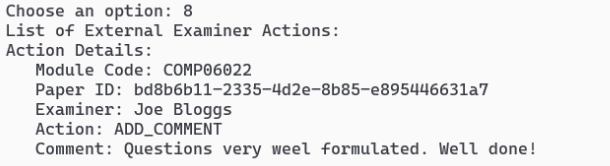

    

# Advanced Software Design

#### Rodrigo Almeida - G00377123

**Introduction**

The ATU Examination Paper Management System is an API designed following the principles of Data-Oriented Programming (DOP) and SOLID. This is a project for the Advanced Software Design Module. The aim is to provide a reliable, easy-to-use, and maintainable interface for interacting with examination data. 

  

**Key Functionalities**

**Main Menu**

    

   
   

**Examiner Management**
- **Creation and listing of examiners**: Handle operations for internal and external examiners. Includes creation of new examiners and listing all examiners.

    
    
    
    

    
  

**Academic Modules Management**

- **Creation and Listing of modules**: Manage academic modules with functionalities for creating new modules and listing all available ones.

    
       

    
 

**Examination Paper Management**

- **Paper Handling**: Creation of new examination papers and all questions following the module rules. It also lists all papers.

    
       

**External Examiner Actions**

- **Action Recording**: Records `comments`, `approvals`, and `rejections` by external examiners on examination papers. It also lists all actions for the Module and the user could choose to list all actions for an existing paper.

    
    

        
        
    
  

   

**Design Patterns Utilization**

- **Singleton Pattern**: An example is the `ExaminerUtil` class, implemented to ensure there is only one instance managing the examiner data throughout the application. This pattern is crucial for centralizing and managing shared resources consistently.

- **Factory Method Pattern**: The methods `createExaminer`, `createInternalExaminer`, and `createExternalExaminer` in `ExaminerUtil` class follow the Factory Method pattern. They encapsulate the object creation process and delegate it to subclasses (Internal and External Examiners).

- **Command Pattern**: The `recordAction` method in `ExternalExaminerServiceImpl` is an example of the Command pattern, where an action (like `Add_Comment`, `Approve`, `Reject`) is encapsulated as an object.

- **Strategy Pattern**: The implementation of interfaces `ModuleService`, `ExaminationPaperService`, `ExternalExaminerService` and `QuestionService` represents the Strategy pattern. Different strategies for handling modules, examination papers, and external examiner functionalities are encapsulated behind these interfaces.

     

**SOLID Principles**

- **Single Responsibility Principle (SRP)**: Classes like `ModuleServiceImpl`, `ExaminationPaperServiceImpl`, `ExaminerUtil`, each have a single responsibility.

- **Open/Closed Principle (OCP)**: The system is extendable without the need for modification. For example, adding new types of examiners or new modules can be done without altering existing code, especially due to the use of interfaces.

- **Liskov Substitution Principle (LSP)**: The use of interfaces and inheritance (like `Examiner interface` implemented by `InternalExaminer` and `ExternalExaminer`) shows adherence to LSP.

- **Interface Segregation Principle (ISP)**: The application follows ISP by creating specific interfaces (`ModuleService`, `ExaminationPaperService`, `ExternalExaminerService` and `QuestionService`) for specific functionalities.

- **Dependency Inversion Principle (DIP)**: The use of high-level modules like `Runner` depending on abstractions (`ModuleService`, `ExaminationPaperService`, `ExternalExaminerService` and `QuestionService`) instead of concrete classes.

     
***
**End**

